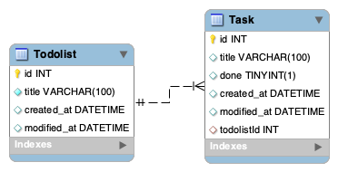

# Todolist API

## Description

This project is a todolist REST API.

This project is build using Node.js, Express and Prisma and contains integration test using Jest and Supertest.

## Package used

- [Express.js](http://expressjs.com/)
- [Prisma](https://www.prisma.io/)
- [Jest](https://jestjs.io/)
- [Supertest](https://github.com/visionmedia/supertest)

## How to install the project

To install the project clone this repository and use `npm install` to install the dependencies.

# API endpoints

| Method | Endpoint                           | Description                                                | Path Parameter      | Request Query Parameter | Request Body     | Response Status | Response Body                          |
| ------ | ---------------------------------- | ---------------------------------------------------------- | ------------------- | ----------------------- | ---------------- | --------------- | -------------------------------------- |
| GET    | /api/todolist                      | Receive a json with the todolists                          | None                | None                    | None             | 200             | json with Todolist                     |
| POST   | /api/todolist                      | Create a new Todolist                                      | None                | None                    | Title            | 200             | json with created todolist             |
| PUT    | /api/todolist/:todolistId          | Will update a todolist                                     | todolistId          | None                    | New Title        | 200             | json updated todolist                  |
| DELETE | /api/todolist/:todolistId          | Will delete a todolist                                     | todolistId          | None                    | None             | 200             | json deleted todolist                  |
| GET    | /todolist/:todolistId              | Returns the title of the todolist and the associated tasks | todolistId          | none                    | none             | 200             | title of todolist and associated tasks |
| POST   | /todolist/:todolistId/task         | Post a new task in the todolist                            | todolistId          | none                    | task title       | 200             | infos about the created task           |
| PUT    | /todolist/:todolistId/task/:taskId | Modify a task item                                         | todolistId - taskId | none                    | new Task details | 200             | infos about the modified task          |
| DELETE | /todolist/:todolistId/task/:taskId | Delete a task item                                         | todolistId - taskId | none                    | none             | 200             | infos about the deleted task           |

## Database Schema

## DB migration

To generate and apply a database migrtion on the database usee `npm run migrate:dev`.
To apply A database migration on the database, use `npm run migrate:apply`
